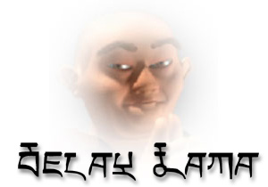
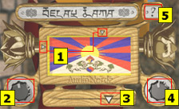
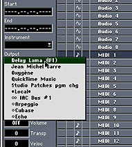

**Delay Lama™ documentation**

Thank you for downloading the Delay Lama™. Read this documentation for information on how to use Delay Lama™. Delay Lama™ is a VST instrument plugin and will run under a VST hosting application such as Cubase or Logic. Delay Lama™ is the first VST-instrument to offer both vocal synthesis and a real-time animated 3D interface. Its advanced monophonic vocal synthesis engine enables your computer to sound just like an Eastern monk, with real-time, high resolution control over the vowel sound. What's more, the plug-in window displays a 3D animation of a singing monk, that reacts directly to your input.

Delay Lama™ is offered completeley free of charge. If you enjoy the plugin as much as we did making it, you are kindly requested to make a donation at [www.savetibet.org](http://www.savetibet.org) .

**Installation Notes**  
To play the Delay Lama™, you will need a VST host application. To learn more about VST instruments you could take a look at [www.sospubs.co.uk/sos/dec00/articles/vst.asp](http://www.sospubs.co.uk/sos/dec00/articles/vst.asp), here you will find a lot of useful information about VST instruments and how to use them. What basically needs to happen is that you need to move the plugin to a folder called "VstPlugIns" in the folder of your host application. If you (re)start your host application now, you are able to open the Delay Lama™ and play it.

|   |   |
|---|---|
|**Playing the Plug**  Once you have the plugin up and running you are able to play it both from the on-screen interface and with your midi keyboard. For the full midi implementation specifications, see the 'Midi Implementation' chapter of this document. Lets take a look at the on-screen interface:||

In the above screenshot of the interface there are some indicated numbers. About the indications:  
**1:** This is an on wood painted tibetan flag which here functions as an XY-controller. Click your mouse on the surface of the flag to let the monk sing. On this surface the Y-axis controls the vowel sound en the X-axis controls the pitch of the singing. The two little triangles (in dutch: 'dingetjes') will indicate your position on the XY-pad.  
**2:** This is the 'Glide' knob, which is used to set the portamento-time. It will only be useful when the Delay Lama™ is played from a midi keyboard.  
**3:** This fader is used to set the level of the delayed signal. Fully opened (most right) the monk will sound like in a echoing environment, fully closed (most left) it will sound completely dry.  
**4:** This is the 'Voice' knob. In center position the monk will sound like the monk he is supposed to be. Turn it left to make the monk more bariton. Turn it right to make more soprano.  
**5:** The '?' button will show the quick-help window.

Have fun playing the Delay Lama™.

**Midi Implementation**  
Delay Lama™ can be controlled with a MIDI keyboard. In this case pitch will be controlled by the note you play on the keyboard, and the pitchbend controller acts as a high-resolution vowel controller. Futhermore all the knobs in the interface are remotely controllable by MIDI and all incoming events are handled with sample-accuracy. So how does it work? It's easy, if you want to control the knobs, here is the controller list:  
Midi pitchbender controls the vowel sound of the voice.  
Midi controller 1 controls the vibrato of the voice (not available in on-screen interface).  
Midi controller 5 controls the portamento time.  
Midi controller 7 controls the volume of the voice (not available in on-screen interface).  
Midi controller 12 controls the amount of the delayed signal mix.  
Midi controller 13 controls the voice caracter.

|   |   |
|---|---|
||What's more, you can record your moves made on the XY-pad of the interface. If your host application supports the plug to send midi data, it is able to record the midi data coming from the XY-pad.  If you want to play the plug by midi, or want to record your moves from the XY-pad, you will have to select the plug as the midi output destination. The picture left here shows how this can be done in Cubase.|

**System Requirements**  
A PC or Macintosh computer capable of running a VST host. At least 8 MB of free RAM for the plugin. If you open the plugin in your host and do not see the animated monk, you should reserve more memory for the host application.  
On Macintosh platform this is possible by selecting the host application in the finder, then selecting 'Get Info' from the 'File' menu (or pressing command-i). Select the 'Memory' option from the 'Show' dialog box and increase the amount of memory in the 'Preferred Size' box. Restart your host application to see the result.  
On Macintosh computers it is highly recommended to disable Virtual Memory. This can be done in the Memory control panel.  
On PC's it is highly recommended to enable the hardware acceleration of your graphics card driver.

**Thank yous:**  
AudioNerdz would like to thank (in no particular order):  
-Tibet Support Group, The Netherlands.  
-AudioEase: Arjen van der Schoot and Peter Bakker.  
-Xavier Rodet (IRCAM) for for the original algorithm.  
-Faculty of Art, Media & Technology of the Utrecht School of the Arts.

**Contact**  
AudioNerdz would like to hear your results from the Delay Lama or find out about your experiences with the Delay Lama™. You can contact us at:

[info@audionerdz.com](mailto:info@audionerdz.com)  
or visit us at [www.audionerdz.com](http://www.audionerdz.com)

**Disclaimer**  
Any resemblance to a person either in existence or deceased is strictly coincidental and not intended as such.

**Legal Stuff**  
VST is a trademark of Steinberg Soft- und Hardware GmbH, Germany.  
Macintosh, Cubase, Logic are trademarks or registered trademarks of their respective owners.  
Delay Lama™ is supplied as is. AudioNerdz hereby disclaim all warrenties relating to this software, whether express or implied, including without limitation any implied warranties of merchantability or fitness for a particular purpose. AudioNerdz will not be liable for any special, incidental, consequential, indirect or similar damages due to loss of data or any other reason , even if AudioNerdz has been advised of the possibility of such damages. The person using the software bears all risk as to the quality and performance of the software.  
This software is provided free of charge and may be distributed freely, as long as all the files are distributed along with the plugin file. It may not be sold or included in any commercial package, nor used as part of any commercial promotion. Contact AudioNerdz if you wish to include it on a CD collection.